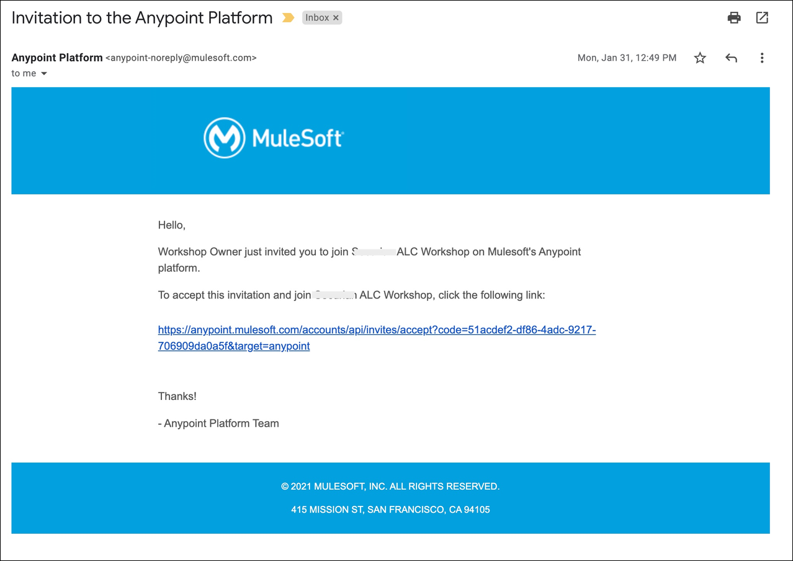
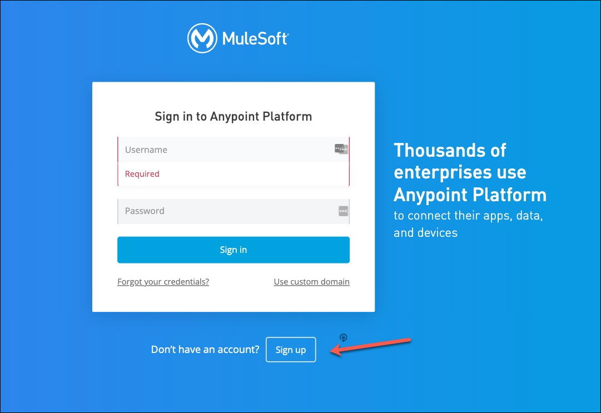
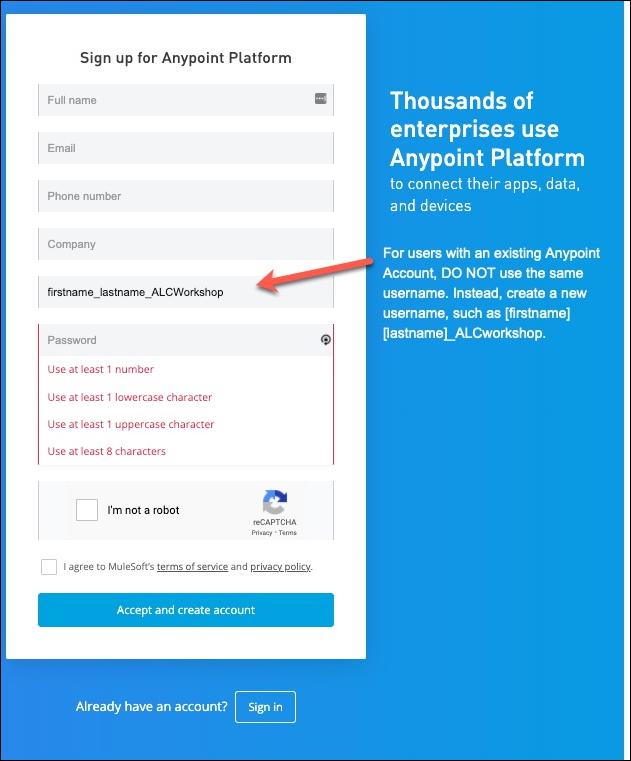

# Workshop Setup Instructions

Welcome to the MuleSoft API Led Connectivity (ALC) Workshop. Below are the instructions to follow in order to gain access to the environment used in the hands-on workshop. You may also click [here](https://salesforce.vidyard.com/watch/dnnPkABGpH5XLYBnDpGFZz?) to watch the video.

You may run the workshop from a company device or a personal device.

## Register for an Anypoint Platform Account

1. Locate the email titled, “Invitation to the Anypoint Platform”, which was sent to all workshop registrants. The email is from <anypoint-noreply@mulesoft.comLeaving the Site>. After clicking the link in the email, follow the instructions below to **setup a new account** to be used during the workshop.

    {: .warning}
    DO NOT use an existing Anypoint account

    *Example image of the email sent from the Anypoint Platform:*

    

2. Begin the steps to register for an Anypoint Platform account by clicking on the link provided in the email. This link directs registrants to the Anypoint Platform sign in page.

3. Click on the link, Sign up, which is located at the bottom of the screen next to “Don’t have an account?”. NOTE: If you have an existing Anypoint Platform account **DO NOT use an existing Anypoint account**. Instead, create a new account for the purpose of the ALC workshop.

    *Image of the sign in page and the Sign up button located at the bottom of the page:*
    

4. Complete the registration form with the required information.
    - **For users with an existing Anypoint Account, DO NOT use the same username**. Instead, create a new username, such as [firstname][lastname]_ALCworkshop.
    - The same email address may be used for multiple Anypoint Platform accounts. *Only the usernames must be different.*

5. Click “Accept and create account” to finish registration in the Anypoint Platform.

    *Image of the registration form:*

    