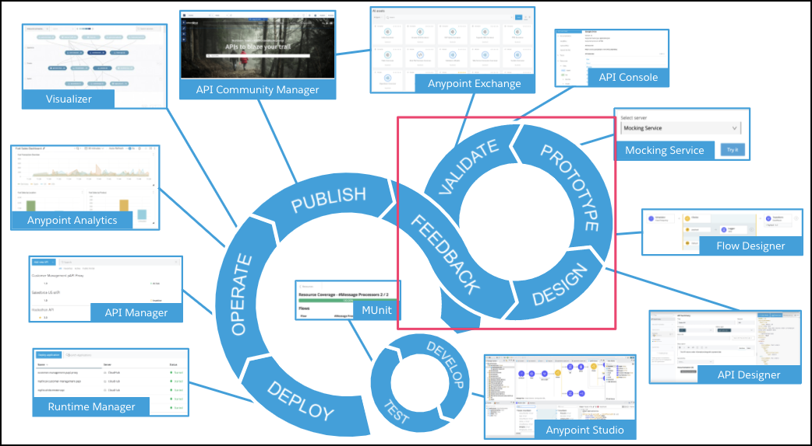
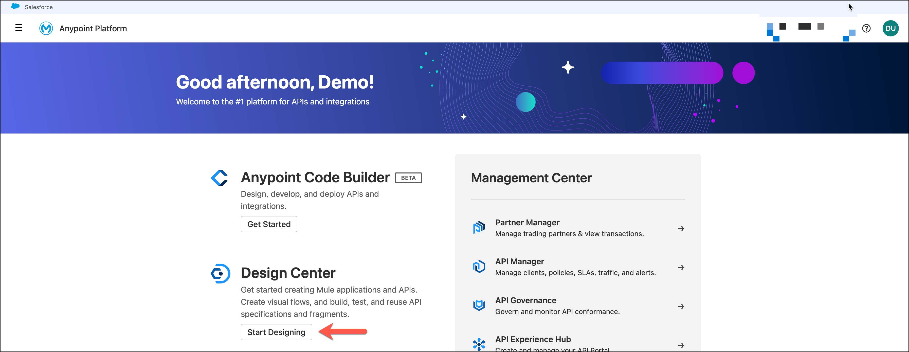

# Module 1 - API Design

## Overview

To get started with the workshop, let’s take a look at how to discover, design, and publish an API specification using the **Anypoint Platform**. Mulesoft advocates for users to adopt a "design first" approach to creating API’s. A "design first" approach is used to enable API consumers the ability to understand, interact, and solicit feedback on the proposed API contract prior to the development effort.

In this first module we will explore the capabilities of the **MuleSoft’s Anypoint Platform** to design, publish, and discover API specifications.

**Anypoint Design Center** provides a set of interactive tools that enable API designers to create or modify the specifications for an API. These specifications form the underlying API contract between the provider and the consumer of the API. **Anypoint Design Center** also enables the development of API Portals, documentation used to communicate to developers how the API should be consumed.

API discovery and collaboration is provided by **Anypoint Exchange** and simplifies the way that reusable assets are discovered and consumed across the enterprise. We will explore the features of **Anypoint Exchange** in detail in this first module.

The first module of the workshop will focus on how to use **Anypoint Design Center** and **Anypoint Exchange** to design, document, publish, and discover the features of a modern API.

The 3 labs in this unit are:

- Lab 1: Search for an API in Exchange
- Lab 2: Design the Omni-Channel API
- Lab 3: Publish the Omni-Channel API to Exchange

Please proceed to [Lab 1](./module-1-lab-1){: .btn .btn-blue  .mr-2  }