1. TOC
{:toc}

# Lab 1 - Search for an API in Exchange
{: .no_toc }

## Overview

API’s are the reusable assets that simplify and accelerate the creation of modern software applications. As a Mulesoft developer you will need to consume API’s created by other members of the organization and publish new API’s for others to consume. This new consumption model is the foundation of a new approach for delivering software solutions where API’s form the building blocks of the modern enterprise.

This first lab will focus on using **Anypoint Exchange** to search for API’s and other assets published in the private exchange.

## Step 1 : Login to Anypoint Platform

1. Go to [https://anypoint.mulesoft.com](https://anypoint.mulesoft.com)

    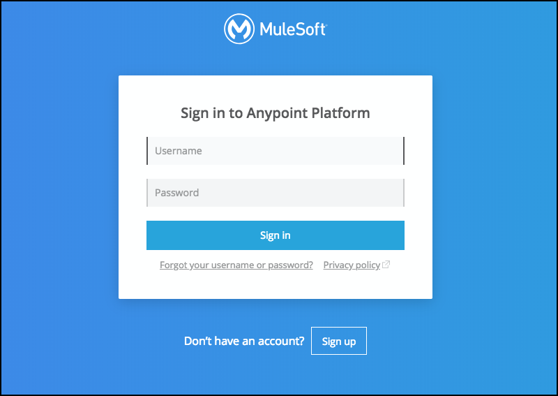
2. Enter **your credentials** into the Username and Password fields.
    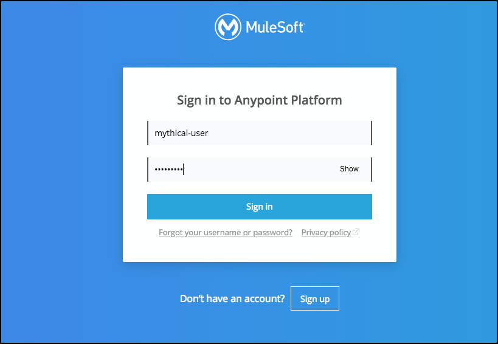
3. You should see the following landing page once you are logged in to Anypoint Platform.
    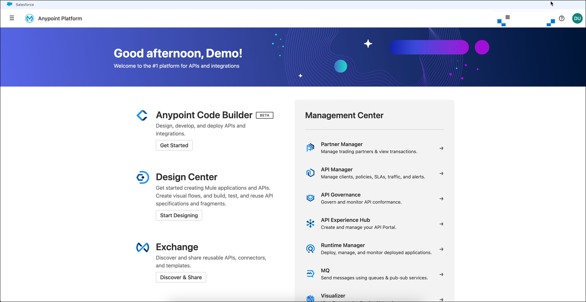
4. Click on the Business Group that is on the right top of the screen. The name will vary with the class.
    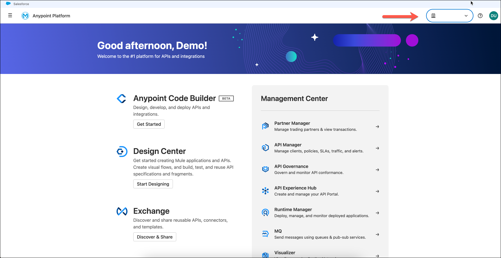
5. There should only be one sub business group, usually the is the second on the list. Select the sub business group.            
    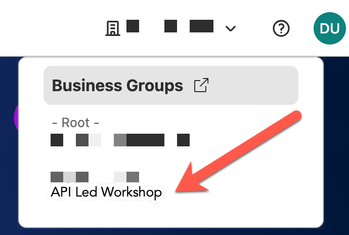

## Step 2: Access Anypoint Exchange

1. Click on the icon labeled "Discover & share"

    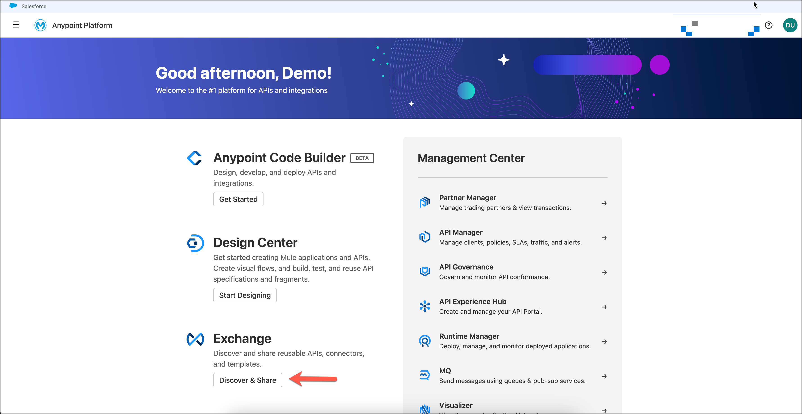

2. You will now be presented the landing page for the **Anypoint Exchange** portal:
    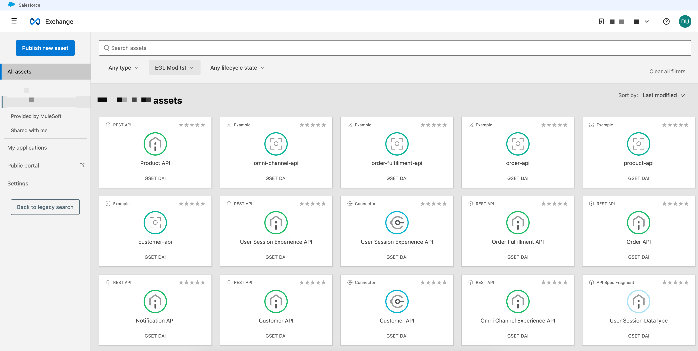

    **Anypoint Exchange** should be your initial starting point for just about any project. If you are looking to reuse an API then **Anypoint Exchange** is obviously where you should start. But even if you are creating a new API to be reused by others, it makes sense to first look in Exchange to see if the API already exists. Sometimes you will find that someone else has already undertaken the task of creating the API, or has created a subset of what you need.

3. **Anypoint Exchange** allows for discovery on the public or private exchange. Every organization will automatically have a private exchange created for them.

    Software assets stored in **Anypoint Exchange** can only be discovered by users that have permissions for the private exchange for that organization. Furthermore, organization administrators can also create independent business groups to provide even more restrictive discovery. **Anypoint Exchange** users can only search within their currently selected business group. The currently selected business group, "Public" in this example, is shown. 

    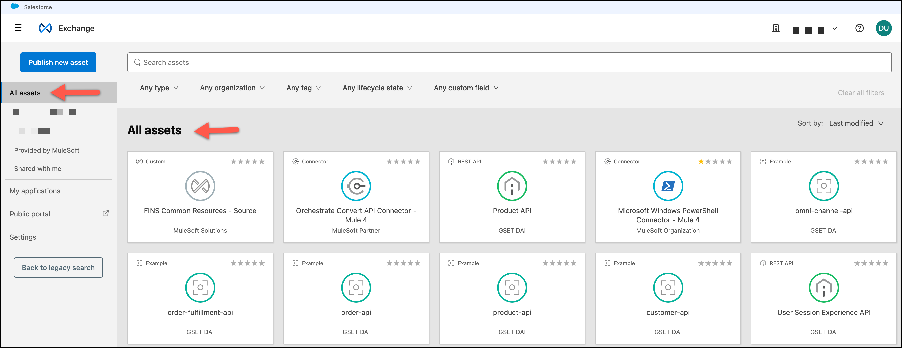

    As you can see from the screen above, there are organizational search criteria on the left hand side of the page. By default searches will search the private exchange only, but you can restrict or expand your searches by selecting a different organizational level. Select All assets to select both MuleSoft public and your private repositories.

    There are two other items behind the last organization **My applications** and **Public Portal**.

    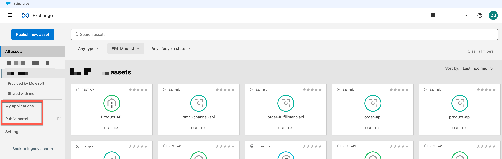

    - **My applications**: These are the clients registered in the organization that are consuming the APIs that are deployed in the organization.

    - **Public Portal**: You can define a public portal to let any user to consume any public org API that the organization may publish.

    To search for an API, use the search bar at the top of the Anypoint Exchange portal:

    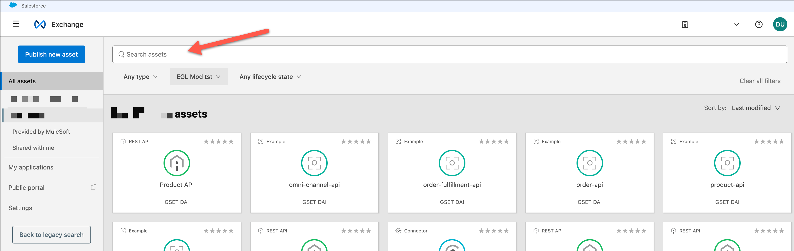
    
    **Anypoint Exchange** supports keyword searching to find the API you are looking for. However, **Anypoint Exchange** can be used as a discovery tool for more than just API’s. **Anypoint Exchange** is the enterprise repository for the following types of reusable software assets.

4. Click on the **All types** drop down next to the search field to view the different search types.
    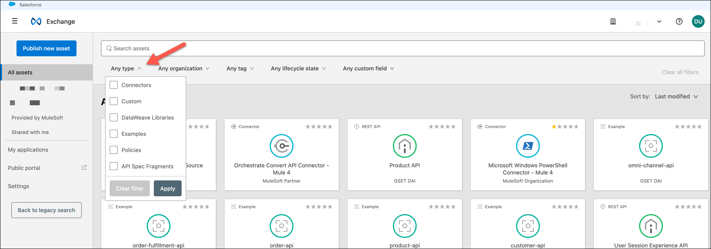

    - **Connectors** - Packaged connectivity to an endpoint developed and deployed on MuleSoft’s Anypoint Platform with third-party APIs and standard integration protocols.

    - **Templates** - Packaged integration patterns that address common use cases and are built on best practices. Applications to which you add your scenario-specific information to complete a use case or solution.

    - **Examples** - Implementation projects that explain development elements within Anypoint Studio and how these can be leveraged to achieve specific API and integration objectives.

    - **Policies** - Configuration modules to extend the functionality of an API and enforce capabilities such as security.

    - **API Groups** - A set of APIs bundled into a single asset. Instead of requesting access to multiple APIs to satisfy a use case, a developer can access the group in one step.

    - **REST APIs** - API descriptions in RAML format that make the consumption of REST API’s faster and easier.

    - **SOAP APIs** - API descriptions in WSDL format that make the consumption of a SOAP API’s faster and easier.

    - **HTTP APIs** - A placeholder for an endpoint for use by private Exchange users who want to manage the endpoint with API Manager

    - **API Spec Fragments** - Shared fragments of RAML files that can be used to assemble new API’s with common traits.

    - **Custom** - A general category for sharing resources such as links, blogs, articles, videos and more.

5. Click on the **Any type** drop down again to collapse it.

6. Click on the **All Assets** business group. The name can vary by class.

    

7. Click on the search field and type **"omni"**, then hit the **Enter Key**.

    The list of Exchange assets should now be filtered to look something like this:
    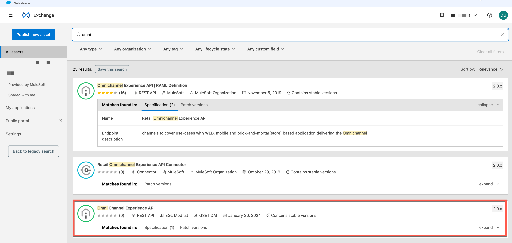

    {: .warning}
    The number of icons listed may vary

8. Click on the tile named **Omni Channel Experience API**.

    You should now see the page dedicated to the API definition.

    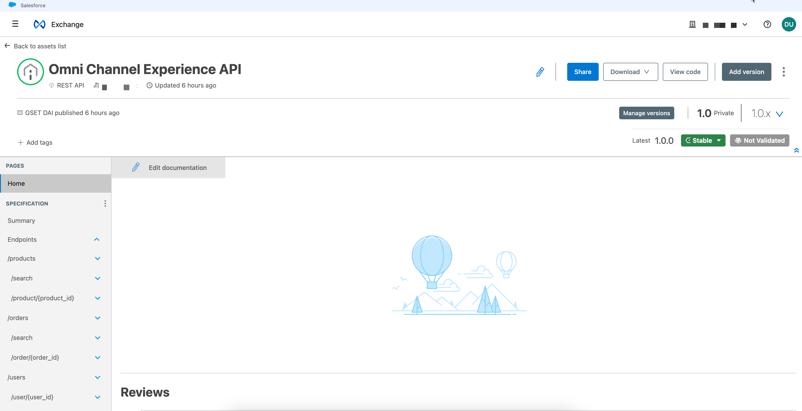

    Exchange provides several new features to support and encourage discovery and collaboration.

    First note the content in the portal to help you learn how to use the API. We will learn how to create this content latter. But for now, let’s do a quick survey of the key features of the Exchange portal:

    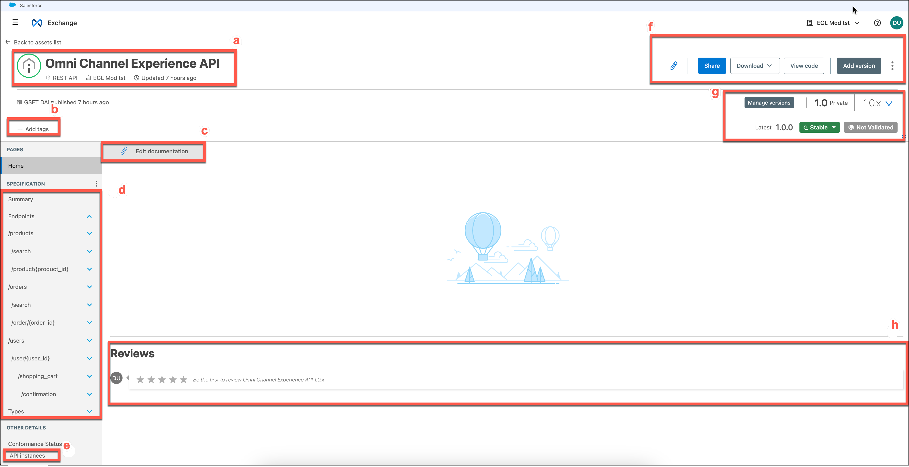

    a. **Information Panel** - This provides general information about the API.

    b. **Add Tags** - Tags make it easier to search and discover API’s. Rather than relying on the title or description of the API, tags allow for you to create categories of API’s related to each other by tags.

    c. **Edit Documentation** Lets you edit the documentation for your API.

    d. **API Summary** - This is the API specification. API resources can be seen here. You can click on each resource and view the documentation.

    e. **API Instances** - This gives you the opportunity to edit the API Implementation endpoints. You can also add other implementations.

    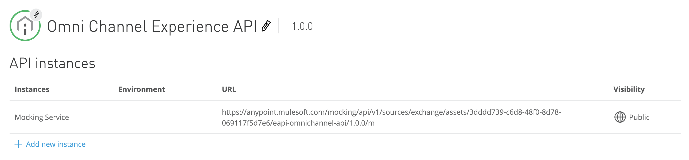
    
    f. **Options Panel** - The options panel has three options.

    - **Edit** (pencil icon): This option allows to edit the API portal.

    - **Share**: This option allows you to share the API with users, users that have a role, or publish to the Public portal.

    - **Download**: This option is to download the RAML Spec or Mule Plugin to use it as a Connector.

    - **View Code**: Opens Design Center.

    - **Add Version**: Lets you create a new version.

    g. **Versions** It shows the different versions of the API. Much of this information is automatically generated during the design and development of the API.
    - **Change Lifecycle State**: Lets you change the state of the version
    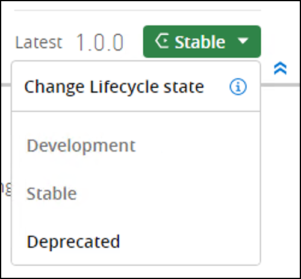
    - **Manage Versions**: Lets you change lifecycle state, crete a new version and download/delete/view in API Designer by clicking the  icon

    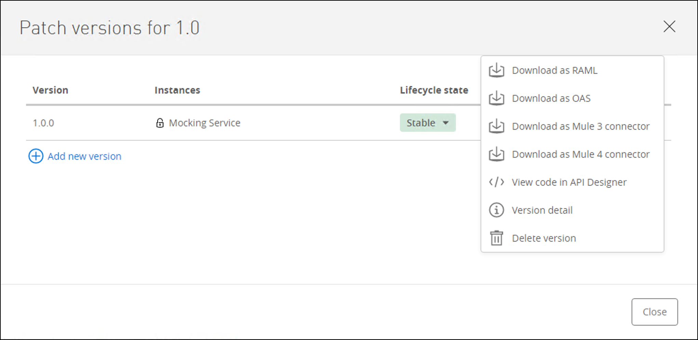

    h. **Ratings and Reviews** - New to Exchange, API users can review and comment on an API. This enables collaboration with the API owner and the ability to share experiences using the API that might help other API consumers.
    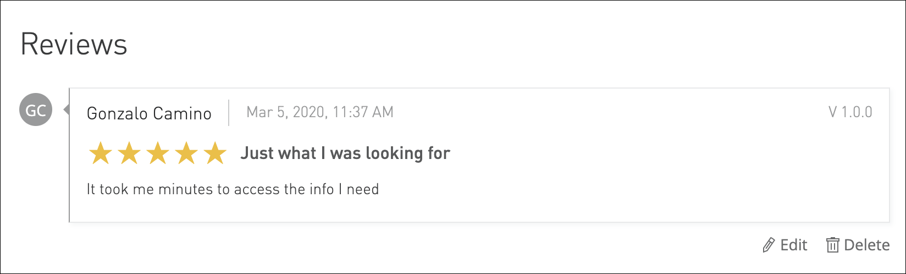

    Let’s explore how to design an API in the next lab.

Please proceed to [Lab 2](./module-1-lab-2){: .btn .btn-blue  .mr-2  }