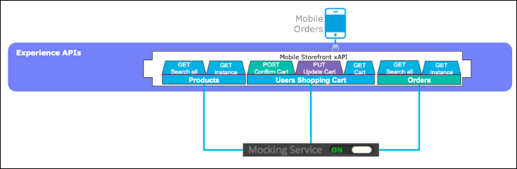

# Lab 2: Design the Omni Channel API

# Overview

In the first lab of this module we learned how to discover the Omni Channel Experience API published in Anypoint Exchange. But of course, somebody had to design this API in the first place. For the purposes of this exercise, let’s ignore the fact that the Omni Channel Experience API already exists. Instead, let’s take on the role of the API designer and explore how to design the experience API using a Design First approach with MuleSoft’s API-led Connectivity methodology. The goal of our Design First approach is to be able to design APIs that are easy to use for their intended target audience.

Anypoint Platform provides first-class tooling to support the needs of the API Designer. Anypoint Design Center provides a robust RAML editor for designing the specifications of the API and standing up a "mock" service to accelerate development efforts. It is also tightly integrated with Anypoint Exchange to simplify the process of discovering and referencing other API design-oriented assets like common data types, traits, schemas, and data examples.

For the purposes of this workshop we will design new API’s using REST. RESTful API’s are very popular right now and support a variety of patterns that help solve many reliability, scalability and integration challenges you might face. We will use an API-first design approach using the RESTful API Modeling Language (RAML) standard. We will follow REST best practices to promote adoption to your consumers. This lab will also introduce the main concepts of resource oriented design and will show how RAML is used to bring APIs to life. For more information on RAML, please see: [www.raml.org](https://www.raml.org).

In this lab, we will start designing a new REST API and test it before implementing it. We will use Anypoint Platform’s **Design Center** to design the API. We will then use **Anypoint Exchange** to search and find data definitions and examples published across the organization that enable us to standardize on common data elements. Lastly, we will utilize the **Mocking Service** to unlock resource dependencies of your API design. This significantly cuts down the time spent building the omni-channel application by turning the RAML design over to the omni-channel developers immediately and adopting a rapid prototyping style. Developers can utilize the mocked up API capabilities to produce a "working" application that calls the Mocking Service.