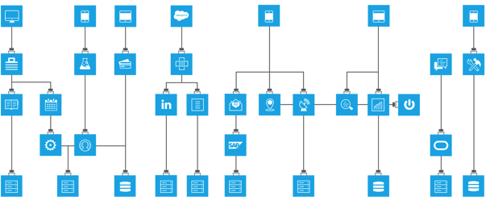

# Module 3 - Uniquitous Connectivity - SOAP Web Service

## Overview

In this module, we will see a great example of legacy modernization. We will create the implementation of our REST Order API that will process requests to a SOAP Web Service.

You will use Anypoint Studio to create a Mule application where there will be one flow for each method of each resource (i.e. GET orders). Additionally you will use APIKit (as part of your Mule application) to process REST requests, transform them to messages to be handled and processed by each flow.

Please proceed to [Lab 1](./lab-1)