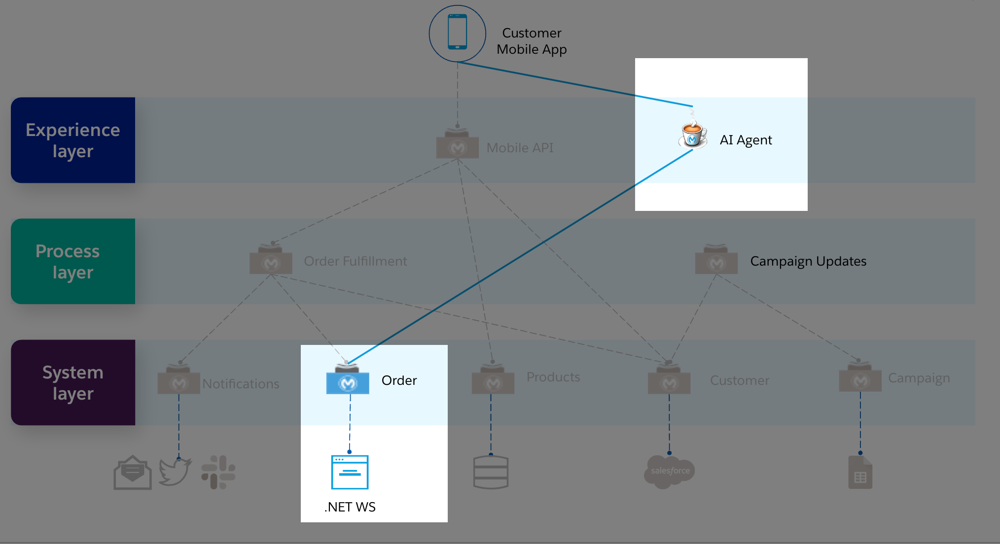

# Module 6 - AI Agent

Once your API-Led architecture is in place, you can seamlessly harness its capabilities to enhance your customer interactions and business processes. By integrating Generative AI with existing APIs, you can provide intelligent, real-time, and context-aware responses to your customers, delivering a more personalized experience.

In this module, you will leverage Generative AI to supercharge your AI Agent, enabling it to answer customer questions about your business and their orders using natural language. 

By connecting to your existing Order API, the AI Agent becomes more informed and relevant, giving customers accurate and up-to-date information. This approach ensures that your AI Agent doesn’t just generate generic answers but delivers responses tailored to your business needs.

This technique is known as Retrieval-Augmented Generation (RAG). RAG enhances Generative AI by combining two powerful capabilities: **Retrieval** and **Generation**. 
- **Retrieval** involves extracting relevant information from a knowledge source — in this case, from your Order API. This ensures that the AI has the most accurate and contextually relevant data. 
- **Generation** is then performed by an AI service (Azure OpenAI in our case), which uses the retrieved information to craft meaningful and precise responses.

In this module, we will demonstrate how easily you can build a business-aware AI Agent by leveraging the MuleSoft AI Chain connector, allowing you to create smarter and more contextually relevant interactions with your customers.