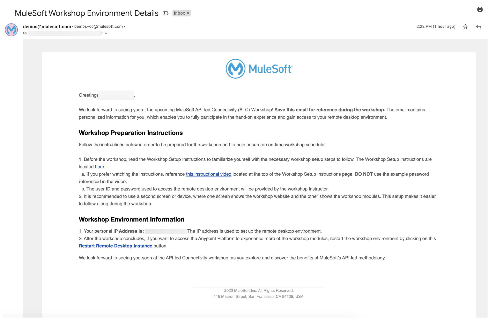
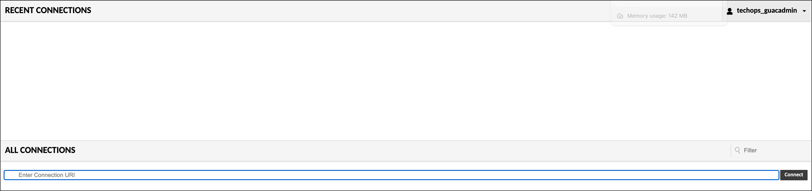
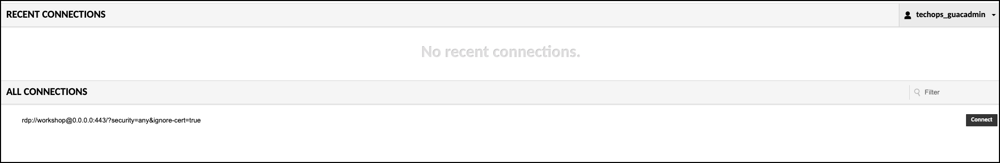
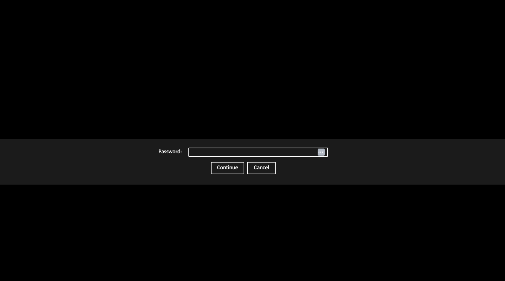

# Setup the Remote Dekstop Gateway

The following will detail an alternate way to gain access to the windows machine provided.

1. Locate the email titled, “MuleSoft Workshop Environment Details” which was sent to all workshop registrants. This email is sent from <demos@mulesoft.comLeaving the Site>. This email contains your unique IP address that will be used for the workshop.

    *Example image of the email containing the workshop environment details:

    

2. Depending on the region where your workshop was provisioned, you need to go to one of these links If in doubt, ask your instructor

    - AMER: https://remote-desktop-amer.workshops.mulesoft.com/Leaving 

    - EMEA: https://remote-desktop-emea.workshops.mulesoft.com/Leaving 

    - JAPAC: https://remote-desktop-japac.workshops.mulesoft.com/Leaving

    *Example image of the Web Terminal login page:*

    

    {: .note}
    User and password will be provided by the instructor

3. Once your are logged in, you will be asked for a 'Connection URI', for this URI you will need the Private IP that was sent to you via email. You should follow the next example to fill the URI (replace 0.0.0.0 with your ip address). Please note that as part of the URI we are providing the screen resolution (1680x1050) to avoid issues when using screen based OCR.
    `rdp://workshop@0.0.0.0:443/?security=any&ignore-cert=true&width=1680&height=1050`

    

    

    You will be asked for a password

    

## Troubleshooting

**This section is to help troubleshoot some most common issues found running this workshop.**

- Cannot login to the Remote Desktop Gateway

    If after setting the right IP, user and password on the Remote Desktop Gateway and clicking Connect!, you get back to the login page again without any error and all the fields empty.

    At this point try:

    - Simply refresh your browser window - In most cases this should fix the problem and you will get automatically into the Remote Desktop Gateway after doing this.

        If this does not work, try:

    - Consider deleting cookies of the browser, or

    - Use Chrome Incognito Mode.

These solutions should fix the problem and let you connect successfully. If not, please ask your instructor for help.

