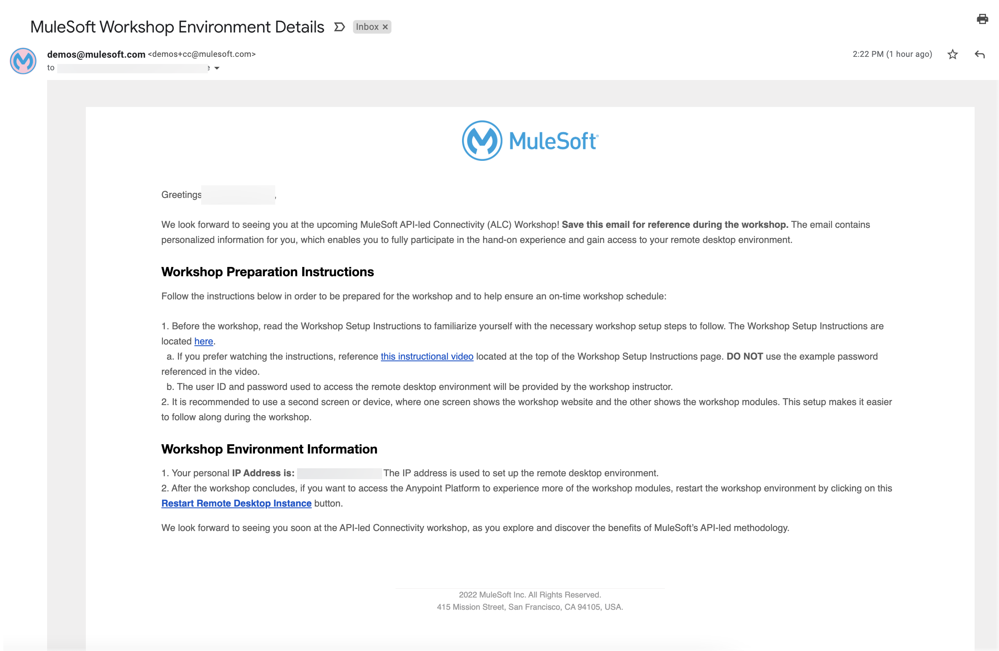
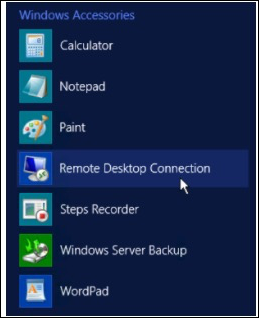
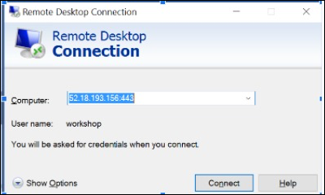
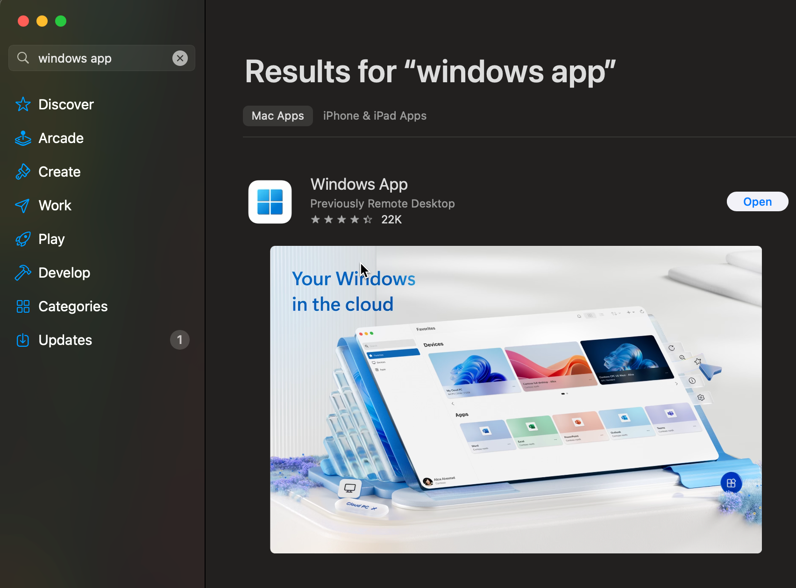
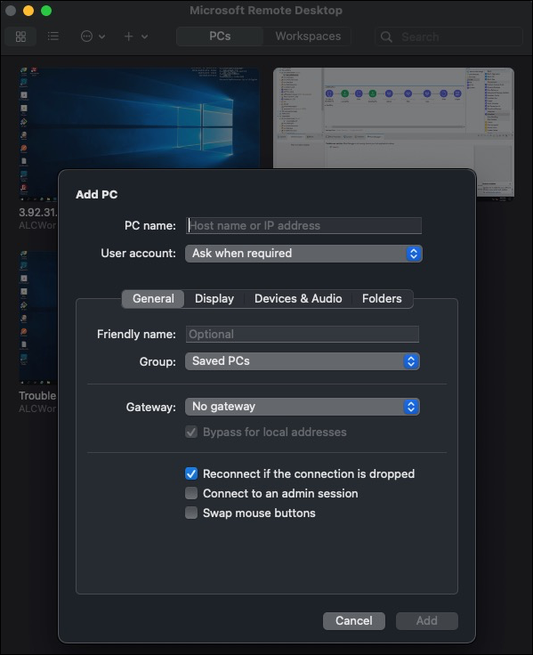
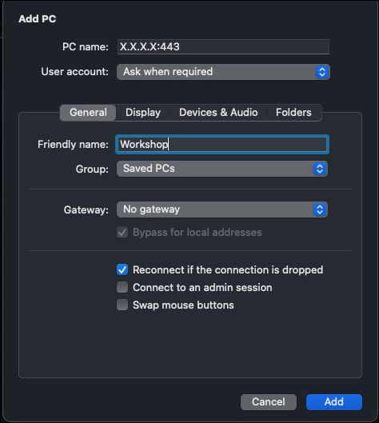
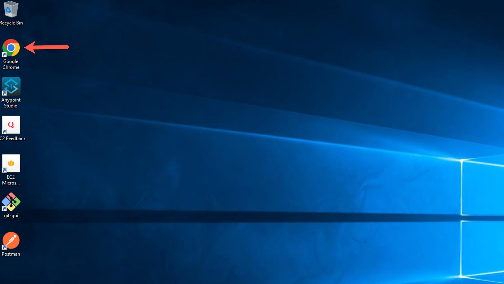
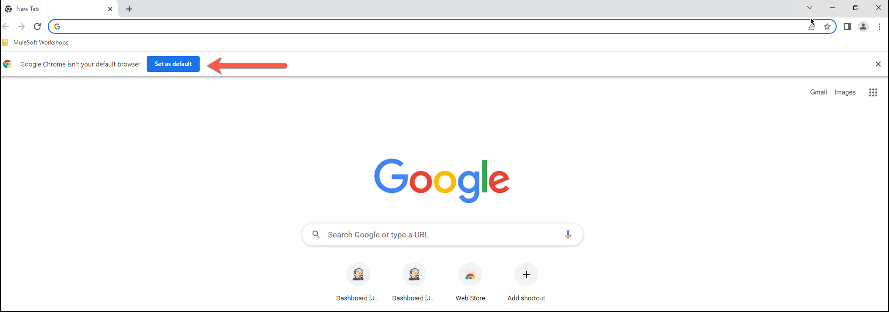

# Setup the Remote Desktop Client

1. Locate the email titled, “MuleSoft Workshop Environment Details” which was sent to all workshop registrants. This email is sent from <demos@mulesoft.comLeaving the Site>. This email contains your unique IP address that will be used for the workshop. The email also contains the link to restart the windows machine after the workshop ends.

    *Example image of the email containing the workshop environment details:*

    

2. Launch the Remote Desktop Client. (See instructions below this section for how to launch the Remote Desktop using a Windows or Mac operating system.)

3. Locate the IP address in the email from **demos@mulesoft.com** and input the IP address in the remote desktop field (the field name varies depending on if the computer uses a Windows or Mac operating system). **Remember to append :443 (<IP address>:443) to the IP address**.

4. Input the Username and Password. The username is: **workshop**. The password will be provided by the workshop instructor. These credentials are private and should not be shared with anyone.

## Steps to connect to the remote desktop from a Windows operating system

1. Click on Start. Select All Programs and then click on Accessories. Another option is to search for Remote Desktop Connection from the Search function on the toolbar.

2. Click on Remote Desktop Connection.

    

3. Enter the IP address provided in the email. Remember to append the IP address with :443 **(<IP address>:443)**

## Steps to connect to the remote desktop from a Mac operating system
1. Download Windows App (formerly known as Remote Desktop App) from the Mac AppStore

    

2. Once downloaded, click on **Add PC**

    

3. In the **PC name** field, input the IP address provided in the email. Remember to append the IP address with :443 **(<IP address>:443)**

    
4. Once inside your virtual machine, make sure to open the Google chrome Browser and make it the browser by default

    

    

