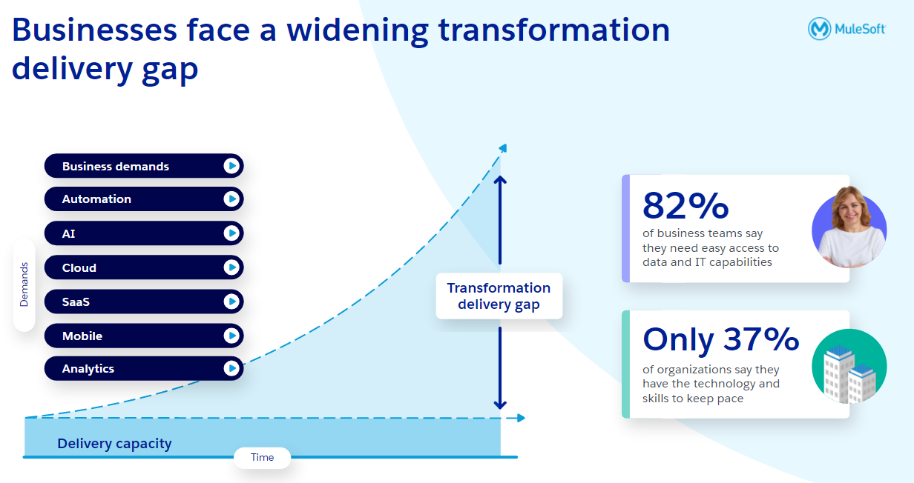
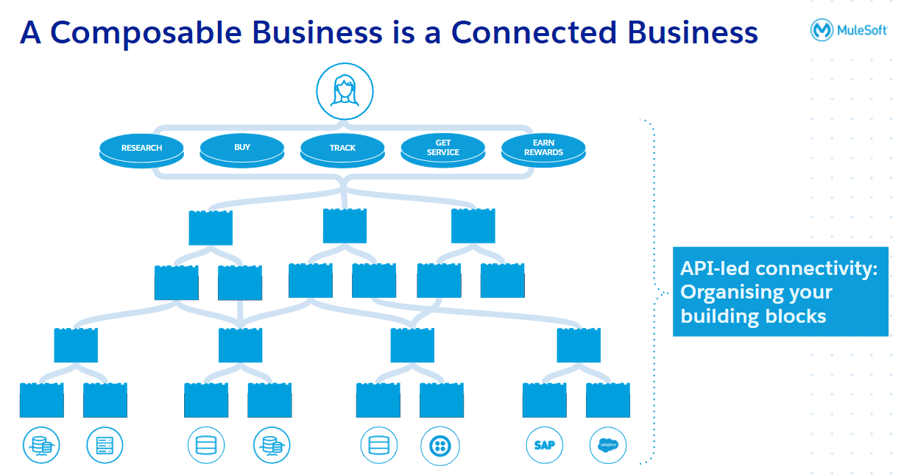
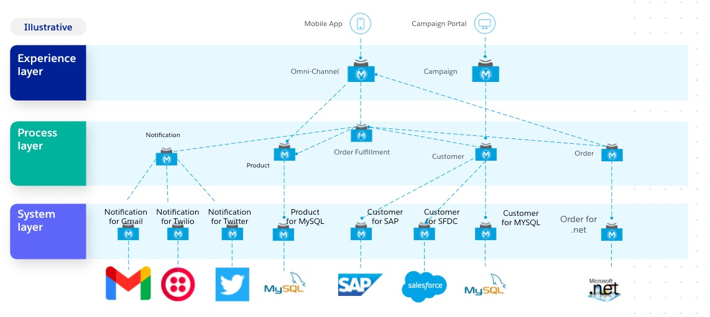
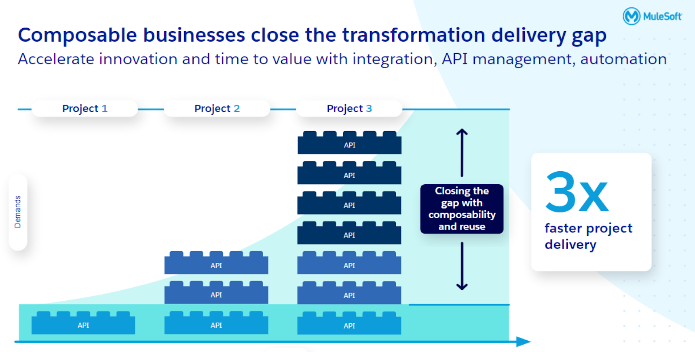

---
# Feel free to add content and custom Front Matter to this file.
# To modify the layout, see https://jekyllrb.com/docs/themes/#overriding-theme-defaults

layout: home
title: Home
nav_enabled: true
nav_order: 1
---

## Organizations of the future will be composable
{: .fs-9 }

CIOs are challenged today to drive change for their organizations by shifting to “digital” technologies. Cloud, mobile, and omnichannel experiences, along with the explosion of IoT, all contribute to the shift in digital transformation. Additionally, there is a growing need to process massive amounts of in-line data and provide analytics through artificial intelligence and machine learning, which puts additional pressure on technology teams to provide valuable insights to business teams, as both teams navigate how to most effectively work together in this complex world of data, system integrations and customer touchpoints. As Klaus Schwab, Execute Chairman of the World Economic Forum stated, “In this new world, it is not the big fish which eats the small fish, it’s the fast fish which eats the slow fish.” CIOs are feeling the pressure to accelerate their delivery, decrease their technical debt and improve overall efficiencies. Organizations will drive business agility and innovation with composable building blocks and API-led connectivity.

Securely build an application network of exponential value, unlocking new business models and revenue streams, with composability. This generational shift demands that we rethink traditional approaches using different types of resources. This comes at a time when IT budgets are limited and the cost of “keeping the lights on” or technical debt is ever-increasing. Companies are forced to do more with less and IT will need to operate differently by taking a composable approach.

IT feels the responsibility to enable the entire enterprise to participate in the digital transformation initiative. Collectively, the enterprise needs to create and maintain what we call an application network. This application network allows organizations to develop, connect and disconnect applications and services as easily as it does with mobile devices. IT must establish composable capabilities to build and enhance these applications as part of a network topology that promotes security and re-use. The core of this capability is a "market" for the production and consumption of these secure and reusable application "assets". MuleSoft’s Anypoint Platform supports this composable enterprise approach.

## Innovate faster in the Anypoint Platform to integrate, manage, monitor, secure and automate key capabilities

Anypoint Platform enables the Application Network and allows the design, sharing, development, maintenance, and securing of the APIs, microservices, and other types of connections that link the network. Consumption-oriented assets can be produced on the Anypoint Platform. These assets can be made available through the platform to a large number of potential consumers. Overall, innovation will be accelerated by reusing these assets to extend existing capabilities and avoid the "reinvention of the wheel."

With the Anypoint Platform, organizations are empowered to produce and share the APIs in a microservices-led architecture that allows others to consume these APIs that are available on the platform. Once these assets are produced, they can be connected securely to the rest of the application network with point-and-click simplicity. The operation of these assets can be monitored and controlled with a single glass pane view with integrated management capability. Finally, these new assets can be made available to other developers or organizations, in order to continue the "leveraged innovation" enabled by the Anypoint Platform that continually promotes reuse and speed: composability.

Given the significance of these changes, it’s important to know that the Anypoint Platform supports making the change in it’s IT operating model by establishing an application network in an incremental way. A major component of an incremental approach is the adoption of these APIs as the way to connect most of the applications. APIs help to decouple systems and processes, and shield any development changes that may occur in the backend without impact on its upstream systems. Another major element is the ability to implement APIs with a microservices-led methodology that are themselves API consumers. All of these APIs can be made available within the enterprise in a lightly governed way by leveraging the Anypoint Exchange. All of these APIs can be categorized or tagged within Exchange. This makes it easy for those developing new functionality to find and reuse as much as possible from existing APIs. These ideas make up what we call an Application Network which ties into MuleSoft’s Composable Connected Business methodology

## Gain incremental application network delivery through Composable Connected Business

In this workshop, we will look at using the Anypoint Platform to incrementally deliver the application network through API-led methodology. We will learn how to design and implement APIs that a mobile application will use for submitting orders and checking order status, which underneath the covers, will connect to and orchestrate a variety of enterprise systems including legacy order processing databases, ERP applications, messaging queues, SaaS and cloud applications. All these systems will be part of a larger composable network of services that allows for scale, security, and reuse.

## Unlock data with the help of API building blocks

A scalable, more strategic approach to integration is needed to keep up with business demands and unlock data silos. This is why 60% of IT leaders report that integration using APIs is critical to their digital transformation strategy.

Modern APIs can be leveraged as building blocks that represent distinct business capabilities, like Product data or order fulfillment, that can be composed easily into a connected experience. API composability allows organizations to innovate faster than ever before.

If various components are wrapped in APIs that can be easily discovered, understood, consumed, and secured, they enable different teams across the organization to access data and digital capabilities in a way never before possible. This approach also gives IT the tools to manage and secure them at scale. This allows organizations to roll out new connected experiences faster, now and in the future.

This is what we call an “API-led Composable Network.” By using a modern API-led approach, each integration becomes a reusable building block.

